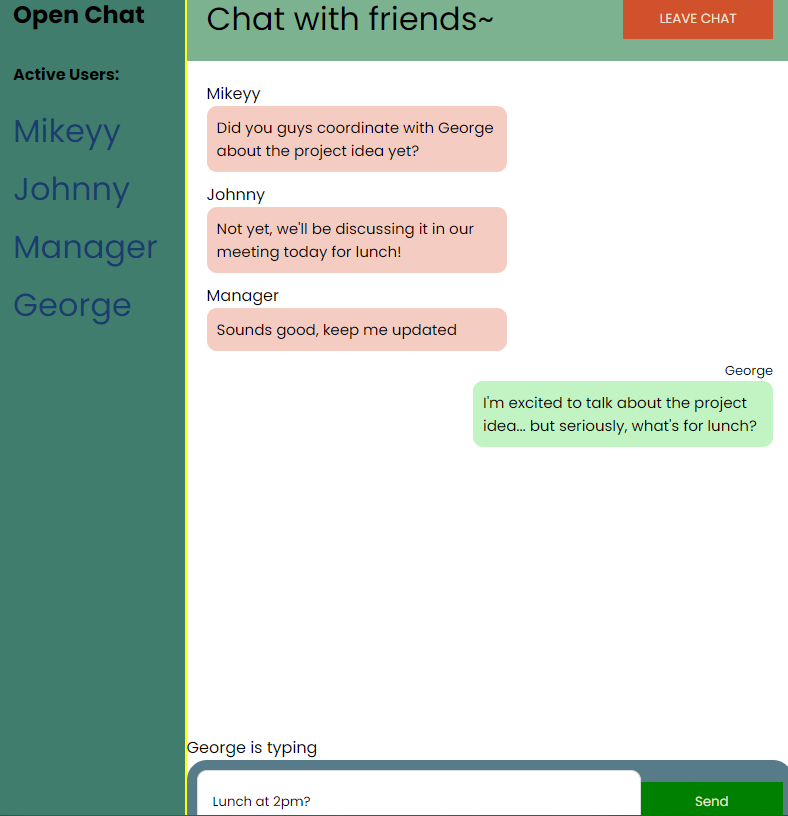

# Real Time - Let's Chat - App

## Welcome to Real Time - Let's Chat - App, an application created to assist you.

got a minute? let's chat! This is a real time chat application utilizing Socket.io, which allows for users to connect a session and chat with others across platforms. Scroll feature, static design, and using State to render the user that's typing! .

## Table of Contents

- [Usage](#usage)
- [Installation](#installation)
- [License](#license)
- [Contribution](#contribution)
- [Tests](#tests)
- [Questions](#questions)

## Preview

- 

## Usage

Users can enter this chat quickly, send messages to others within their own chat room.

## Installation

install dependencies and follow comments

## License

[]

## Contribution

gsaaad

## Tests

jest

## Questions

If you have questions, email me @ : georgesaad.codes@gmail.com/ Github: [gsaaad](https://github.com/gsaaad)
